background-image: url(img/ses05_T02.jpg)
background-size: contain;

---
name: about-us

.left-column[
## About Me


[@river](http://twitter.com/river)
]

.right-column[
* `ASP`,  `PHP`(CodeIgniter -> Laravel), `Magento`
* [`Laravel Korea` 페이스북 그룹](https://www.facebook.com/groups/laravelkorea/)
* [https://laravelrocks.com](https://laravelrocks.com)
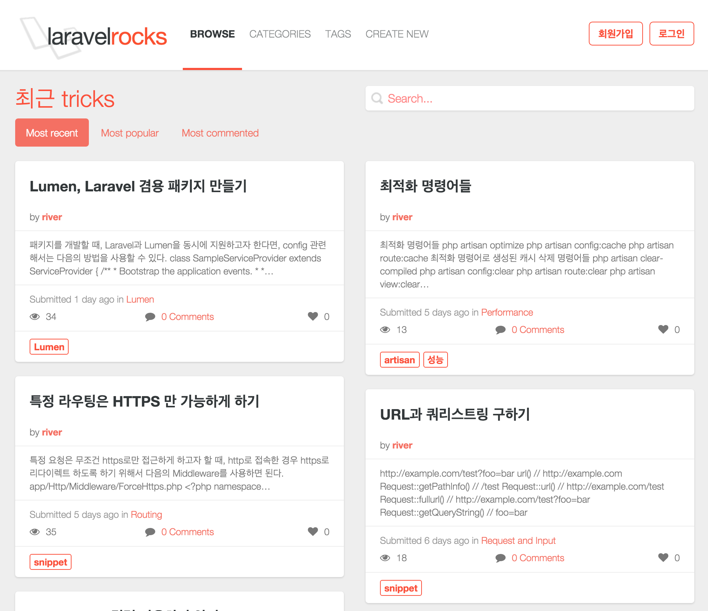
]

---

## Agenda
`php artisan route:list`

* What
* How
* Some Tips
* Wrap Up
---

class: center, middle


# What ? 
`composer require 동영상/동영상`

---

## 동영상 서비스

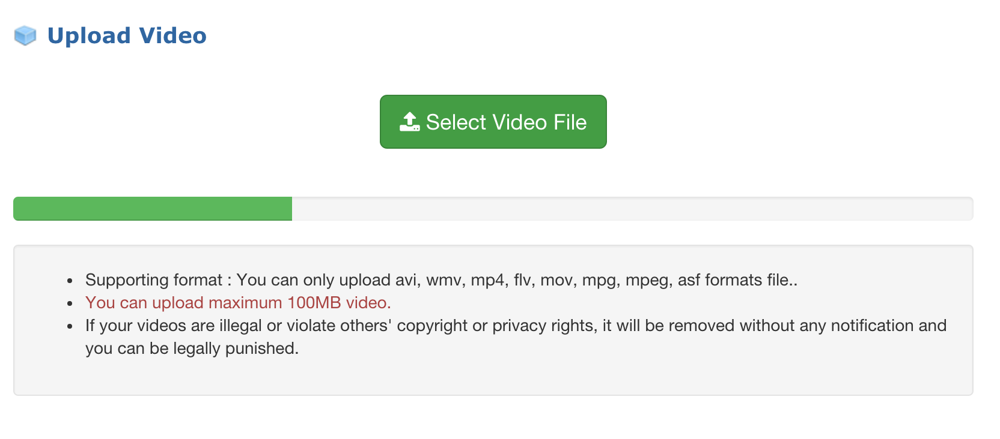

---

## 동영상 서비스

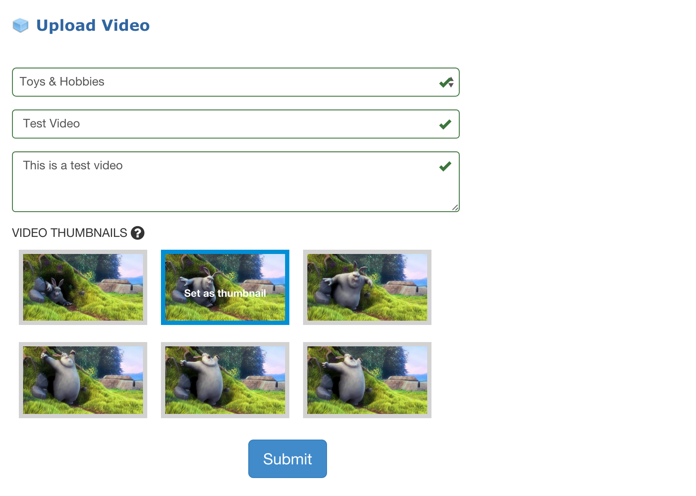

---

## 동영상 서비스

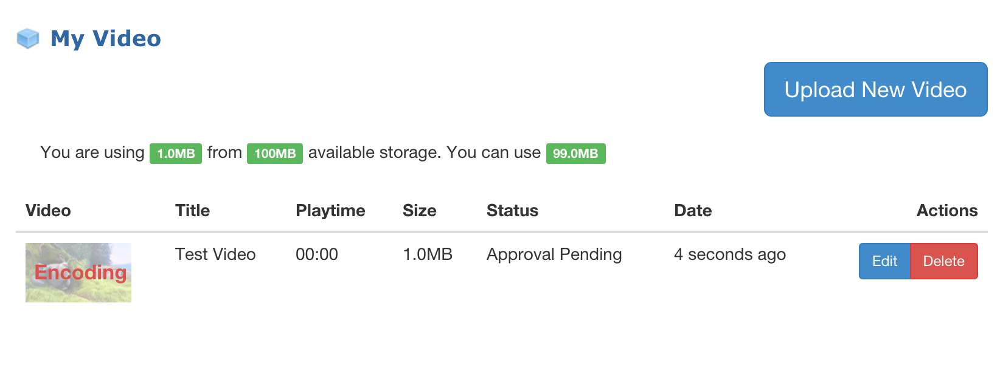

---

## 동영상 서비스

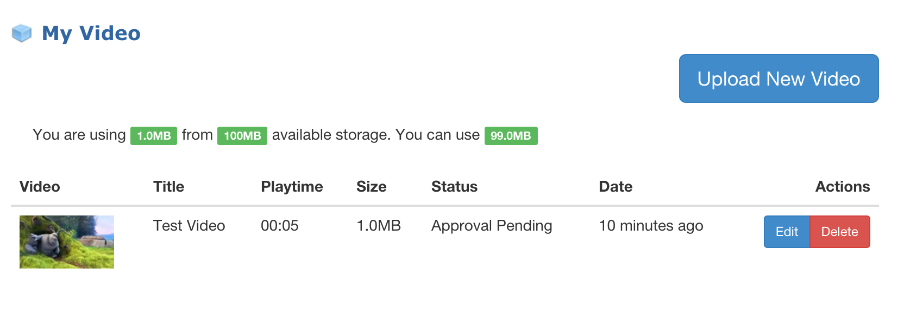

---

## 동영상 서비스

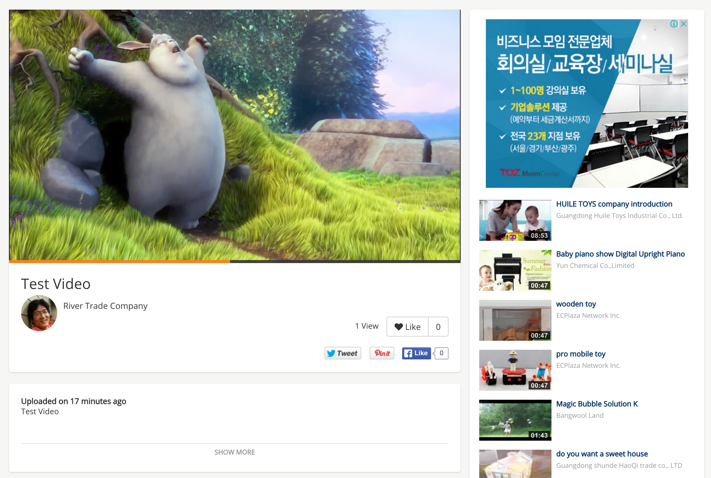

---
class: center, middle


# How ?

---
class: center, middle

# 개발환경
`php artisan down`

Laravel 5.1<br>
Homestead<br>
phpstorm<br>
yobi<br>
phpunit, codeception<br>

---
class: center, middle

# 동영상 처리
.degrade[업로드된 동영상 파일에서 `스냅샷` 📷 이미지 생성하고,<br>`mpeg4`로 변환]

---
# [FFmpeg](https://www.ffmpeg.org/)

* 동영상 정보 구하기
* 스냅샷 이이지 생성
* 동영상 컨버팅
* 빌드 
  - H.264 video encoder, AAC audio encoder, MP3 audio encoder, ...
  - https://trac.ffmpeg.org/wiki/CompilationGuide/Ubuntu
  - `ffprobe`, `ffmpeg`

---
## 🎁 [php-ffmpeg/php-ffmpeg](https://github.com/PHP-FFMpeg/PHP-FFMpeg) 패키지

```
$ffprobe = FFMpeg\FFProbe::create();
$ffprobe
  ->format('video.avi')
  ->get('duration'); // returns the duration property


$ffmpeg = FFMpeg\FFMpeg::create();
$video = $ffmpeg->open('video.avi');
$video
  ->frame(FFMpeg\Coordinate\TimeCode::fromSeconds(10))
  ->save('frame.jpg'); // saves snapshot image

$video
  ->save(new FFMpeg\Format\Video\X264(), 'video.mp4');
```    

---
class: center, middle
name: video-convert

background-image: url(img/bored-computer.jpg)
background-size: contain;

# 동영상 변환 대기 시간 💤

---
## 비동기 처리

* Laravel queue driver : database, [Beanstalkd](http://kr.github.com/beanstalkd), [IronMQ](http://iron.io/), [Amazon SQS](http://aws.amazon.com/sqs), [Redis](http://redis.io/), sync
* [IronMQ](http://www.iron.io/)
<br>
.center[]

---
## [IronMQ](http://www.iron.io/)

* 클라우드 기반의 메시지 큐 웹서비스
* 회원 가입 및 프로젝트 생성 -> token 발급
* 1M API Requests/Month Free 
* Pull Queue / Push Queue
.center[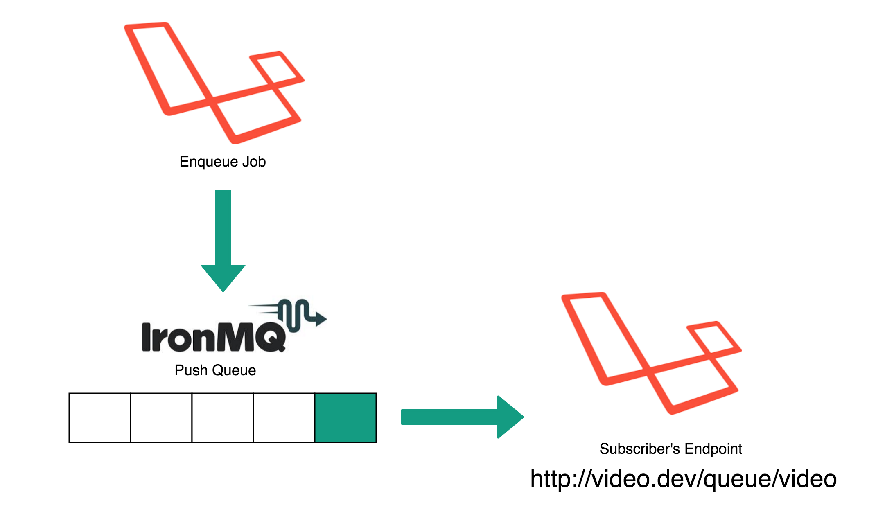]

---
## IronMQ - Config

`package.json`
```json
"iron-io/iron_mq": "2.*"
```

`.env`
```terminal
QUEUE_DRIVER=<span class="code-em">iron</span>
```

`config/queue.php`
```terminal
'iron' => array(
  'driver'  => 'iron',
  'host'    => 'mq-aws-us-east-1.iron.io',
  'token'   => '[YOUR TOKEN]',
  'project' => '[YOUR PROJECT ID]',
  'queue'   => 'video',
  'encrypt' => false,
),
```

---
## IronMQ - Job Class

`app/Jobs/ConvertVideo.php`
```php
class ConvertVideo extends Job implements SelfHandling, ShouldQueue
{
    use InteractsWithQueue, SerializesModels;


    private $video;


    public function __construct(Video $video)
    {
        $this->video = $video;
    }

    public function handle(VideoRepo $videoRepo)
    {
      // Convert video
      ...
    }
}
```

---
## IronMQ - Controllers, Route, Middleware

`app/Http/Controllers/VideosController.php`
```php
// 동영상 변환 큐잉
$this->dispatch(new ConvertVideo($video));

// 큐 이름 지정 방법
$job = (new ConvertVideo($video))->onQueue('video');
$this->dispatch($job);
```

`app/Http/routes.php`
```php
// `IronMQ`에서 불려짐 
Route::post('queue/video', function () {
    return Queue::marshal();
});
```

`app/Http/Middleware/VerifyCsrfToken.php`
```php
// 제외 route
protected $except = [
  'queue/video',
];
```

---
`Illuminate\Queue\Queue`
```php
protected function createPayload($job, $data = '', $queue = null)
{
  ...
  return json_encode([
    'job' => 'Illuminate\Queue\CallQueuedHandler@call',
    'data' => ['command' => serialize(clone $job)],
  ]);
  ...
}
```    

```terminal
[command] => O:21:"App\Jobs\ConvertVideo":4:{s:28:"App\Jobs\ConvertVideovideo";
O:45:"Illuminate\Contracts\Database\ModelIdentifier":2:
{s:5:"class";s:17:<span class="code-em">"Ecplaza\Emp\Video"</span>;s:2:<span class="code-em">"id"</span>;i:143;}
s:5:"queue";N;s:5:"delay";N;s:6:"*job";N;}
```

`Illuminate\Queue\CallQueuedHandler`
```php
public function call(Job $job, array $data)
{
  $command = $this->setJobInstanceIfNecessary(
    $job, unserialize($data['command'])
  );

  ...
}

```

---
## IronMQ - public URL 

IronMQ가 접근할 수 있도록 `queue/video`를 공개

* [finch](https://meetfinch.com/), [ngrok](https://ngrok.com/)

```terminal
$ npm install --global finch
$ finch login
$ finch forward http://video.dev

→ Requesting connection... <span class="code-check">✔</span>
→ Establishing secure connection... <span class="code-check">✔</span>

The following sites are now being forwarded. Press CTRL+C at any
time to end your session:

-----------------------------------------------------
| Public URL                     | Private URL      |
-----------------------------------------------------
| <span class="code-em">https://worm-large.usefinch.io</span> | http://video.dev |
-----------------------------------------------------
```

---
## IronMQ - Subscribe

Add subscriber

.center[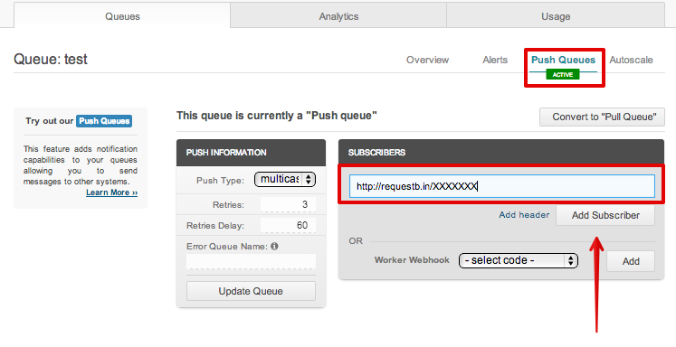]

또는

```terminal
php artisan queue:subscribe video https://worm-large.usefinch.io/queue/video
```

---
class: center, middle
name: queue-demo

<video width="100%" controls>
  <source src="img/ironmq.mp4" type="video/mp4">
Your browser does not support the video tag.
</video>

## 데모 동영상

---
## IronMQ - Testing

Job 테스팅시는 `sync`로

`.env`
```terminal
QUEUE_DRIVER=<span class="code-em">sync</span>
```

---
## IronMQ

#### 장점

* 비동기 처리
* 로직 분리
* 스케일러블 

#### 단점

* 구성할 때 할 일이 많다.
* 디버깅이 힘들다.

---
class: center, middle

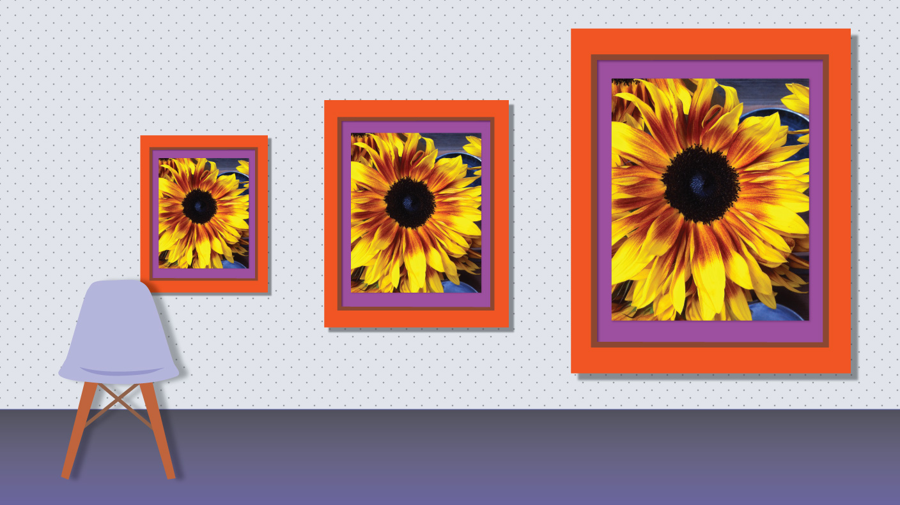
# 스냅샷 이미지 리사이징 
.degrade[`스냅샷` 📷 이미지에서 `리스트용`, `재생 포스터용` 등<br>필요한 크기의 이미지 생성]

---
class: center, middle

# 🎁 [Intervention](http://image.intervention.io/) 사용해서 구현

.left.wider-width.block-center[
## 단점
썸네일 사이즈가 변경되거나 새로운 사이즈의 썸네일이 필요한 경우
* 일괄 신규 생성
* 미사용 썸네일 삭제

웹 애플리케이션마다 이미지 처리 중복 구현
*  이미지 처리 레이어 분리
]

# 이미지 처리 전용 <br>서버를 찾아보자 🔎


---
class: center, middle
name: thumbor

background-image: url(img/bg-thumbor.jpg)
background-size: contain;


http://thumbor.org/

https://github.com/thumbor/thumbor

---
# [thumbor](http://thumbor.org/)

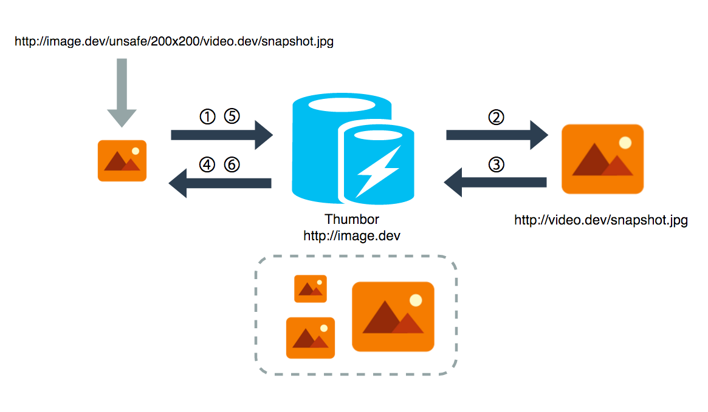

---
# [thumbor](http://thumbor.org/)

* 이미지 처리(리사이징, 필터링, 얼굴인식 등) 및 캐시 서버
* 웹 애플리케이션에서 이미지 처리 레이어를 분리
* 동적 생성. 원하는 크기의 이미지를 언제라도 사용 가능
* WebP detect

---
name: thumbor-usage 

# [thumbor](http://thumbor.org/)

> http://thumbor-server/unsafe/<kbd>width</kbd>x<kbd>height</kbd>/<kbd>host</kbd>/<kbd>path</kbd>

<br>

🎁 [ceejayoz/laravel-phumbor](https://github.com/ceejayoz/laravel-phumbor) 패키지 사용

```php
Phumbor::url('http://images.example.com/foo.jpg')
    ->resize(300, 200)
    ->addFilter('fill', 'green');
```

---
class: center, middle
name: easy 

background-image: url(img/easy.jpg)
background-size: contain;

# 참 쉽죠 !

---
class: center, middle

# 유사 서비스  

[Imgix](https://www.imgix.com/)<br>
[Thumbr.io](http://www.thumbr.io/)<br>
[Cloudinary](http://cloudinary.com/)<br>
[Huluma](http://huluma.net/)<br>
[LibPixel](http://libpixel.com/)<br>
[WeServe](http://images.weserv.nl/)<br>


---
# Front

* [Bootstrap](http://getbootstrap.com/), [jQuery](https://jquery.com/)
* Video player : [videojs](http://www.videojs.com/)
* Javascript loader : [RequireJS](http://requirejs.org/)
* Task runner : [gulp](http://gulpjs.com/)

---
`php artisan up`
.center[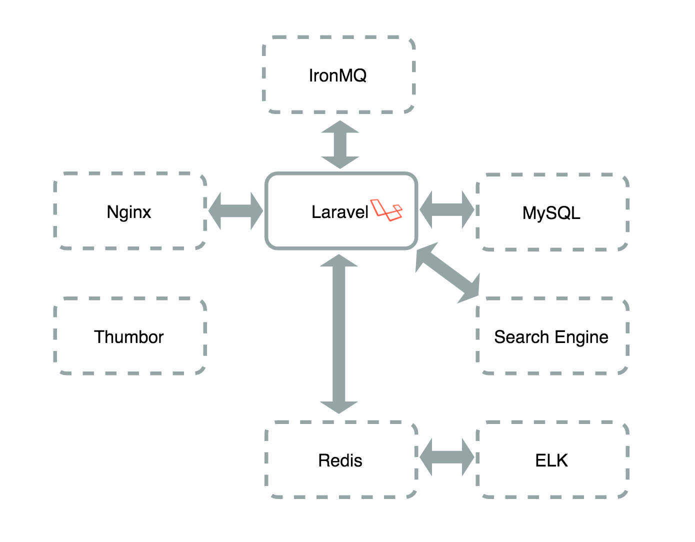]

---

.left-column[
## Some Tips
]

.right-column[

ELK를 이용한 실시간 로그 모니터링

`App\Http\Middleware\AttachLogstash`

```
class AttachLogstash
{
    public function handle($request, Closure $next)
    {
        if (App::environment() !== 'testing') {
            $monolog = Log::getMonolog();
            $redis = new RedisHandler(
                Redis::connection(),
                config('logstash'),
                Logger::INFO
            );
            $formatter = new \Monolog\Formatter\LogstashFormatter('example.com');
            $redis->setFormatter($formatter);
            $monolog->pushHandler($redis);
        }

        return $next($request);
    }
}
```

[UptimeRobot](https://uptimerobot.com/)
]

---
## Wrap Up
`php artisan optimize` 

* FFMpeg
* Laravel Queue
  - IronMQ
* Thumbor  

---
## Reference

* [FFMpeg build](https://trac.ffmpeg.org/wiki/CompilationGuide/Ubuntu)
* [IronMQ and Laravel: Setup](http://www.sitepoint.com/ironmq-laravel-setup/)
* [Best Thumbnailing Solution - Set up Thumbor on AWS ](http://www.dadoune.com/blog/best-thumbnailing-solution-set-up-thumbor-on-aws/)
* [이미지 썸네일 생성에 관하여 (thumbor)](http://www.slideshare.net/yhbyun/thumbor-50127420)
* [redis, logstash, elasticsearch, kibana를 이용해서 실시간 로그 모니터링 하기](https://laravelrocks.com/tricks/40-realtime-monitor-with-redis-logstash-elasticsearch-kibana)

---
class: center, middle

# `php artisan serve` 

슬라이드 http://yhbyun.github.io/laravel-video
